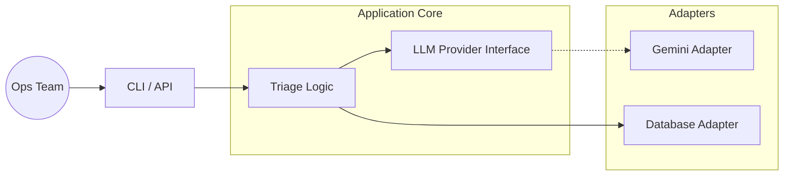

# 🛡️ AI-Driven ITSM Triage Engine

> A resilient, cloud-agnostic microservice for automated IT ticket classification using Large Language Models (LLMs). Designed with Clean Architecture principles.


## 📋 Executive Summary

This project demonstrates a production-grade approach to applying Generative AI in DevOps/IT Operations. Unlike simple scripts, this engine is built as a modular microservice capable of:
1.  **Ingesting** raw IT tickets from a database.
2.  **Classifying** them intelligently using swappable LLM backends (Google Gemini, OpenAI, Local models).
3.  **Handling** real-world API instability with robust retry policies.

**Key Architectural Decisions:**
* **Strategy Pattern:** The LLM provider is injected at runtime, preventing vendor lock-in.
* **Resiliency:** Implements Exponential Backoff & Jitter strategies to handle HTTP 429 (Rate Limits).
* **Observability:** Structured JSON-ready logging instead of standard output printing.

---

## 🏗️ Architecture

The system follows **Hexagonal Architecture (Ports and Adapters)** to decouple the core business logic from external dependencies.



## 🚀 Features

* **Multi-Provider Support:** Abstracted `LLMProvider` interface allows seamless switching between Gemini (Flash 1.5), GPT-4, or Mistral.
* **Self-Healing:** The adapter layer automatically handles API quotas and transient network failures using an exponential backoff algorithm.
* **Synthetic Data Pipeline:** Includes a QA tool (`generate_synthetic_data.py`) that uses AI to generate thousands of realistic, diverse IT tickets for load testing.
* **Type Safety:** 100% type-hinted codebase compliant with `mypy` strict mode.
* **Timezone Awareness:** All timestamps are UTC-normalized to ensure global consistency.

---

## 🛠️ Installation & Setup

### Prerequisites

* Docker (Recommended) OR Python 3.13+
* A Google Gemini API Key (Free tier available)

### Quick Start (Docker)

1. **Clone the repository:**
```bash
git clone [https://github.com/your-username/ai-ticket-triage.git](https://github.com/your-username/ai-ticket-triage.git)
cd ai-ticket-triage

```


2. **Configure Environment:**
Create a `.env` file in the root directory:
```ini
GEMINI_API_KEY=your_api_key_here
DB_URL=sqlite:///tickets.db

```


3. **Build the Container:**
```bash
docker build -t triage-engine:latest .

```


4. **Generate Test Data (Optional):**
Populate the database with AI-generated synthetic tickets.
```bash
# PowerShell
docker run --rm --env-file .env -v ${PWD}:/app triage-engine:latest python generate_synthetic_data.py

```


5. **Run the Classification Engine:**
```bash
# PowerShell
docker run --rm --env-file .env -v ${PWD}:/app triage-engine:latest python -m src.main

```


---

## 📂 Project Structure

```text
/ai-ticket-triage
├── Dockerfile                  # Multi-stage build for Python 3.13
├── generate_synthetic_data.py  # Ops tool for load testing (QA)
├── src/
│   ├── adapters/               # Implementations (Gemini, OpenAI)
│   ├── core/                   # Entities and Database Models
│   ├── interfaces/             # Abstract Base Classes (Contracts)
│   └── main.py                 # Application Entrypoint
└── requirements.txt            # Pinned dependencies

```

## 🔮 Future Roadmap

* [ ] **FastAPI Integration:** Expose classification as a REST Endpoint.
* [ ] **Config Externalization:** Move categories to `config.yaml` for dynamic reloading.
* [ ] **RAG Implementation:** Use vector embeddings to suggest solutions based on historical ticket resolutions.
* [ ] **Prometheus Metrics:** Export success/failure rates and latency metrics.

---

**Author:** Alejandro Casa