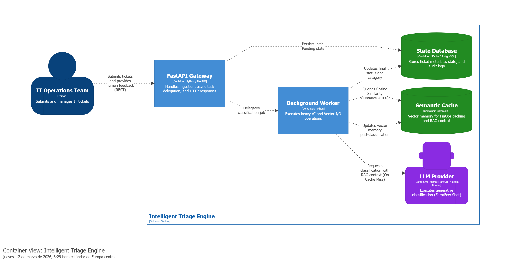
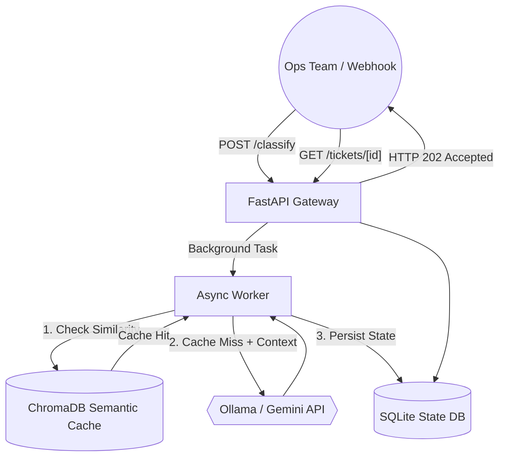

# 🛡️ AI-Driven ITSM Triage Engine

> An Enterprise-grade, asynchronous microservice for automated IT ticket classification. Powered by Sovereign Local AI, Semantic Caching (FinOps), and Retrieval-Augmented Generation (RAG).


## 📋 Executive Summary

This project demonstrates a production-grade approach to applying Generative AI in DevOps/IT Operations. It moves beyond simple API wrappers into a resilient, FinOps-optimized architecture capable of:
1.  **Asynchronous Ingestion:** Accepting high-volume ticket bursts without blocking the main thread.
2.  **Semantic Caching:** Slashing LLM API costs by up to 66%+ by mathematically identifying and resolving recurring issues locally.
3.  **Data Sovereignty:** Full capability to run 100% locally via Ollama (Llama 3), ensuring zero data leaks to external cloud providers.
4.  **Human-in-the-Loop (RAG):** Learning dynamically from human corrections without requiring expensive model retraining.

---

## 🏗️ Architecture (C4 Model)

The system utilizes an Event-Driven API Gateway pattern paired with a local Vector Database for semantic memory.




```mermaid
graph TD
    User((Ops Team / Webhook)) -->|"POST /classify"| API[FastAPI Gateway]
    API -->|"HTTP 202 Accepted"| User

    API -->|"Background Task"| Worker[Async Worker]
    Worker -->|"1. Check Similarity"| Chroma[(ChromaDB Semantic Cache)]
    Chroma -- "Cache Hit" --> Worker

    Worker -->|"2. Cache Miss + Context"| LLM{{Ollama / Gemini API}}
    LLM --> Worker

    Worker -->|"3. Persist State"| SQL[(SQLite State DB)]
    User -->|"GET /tickets/[id]"| API
    API --> SQL

```

## 🚀 Key Features

* **Multilingual FinOps Vector Shield:** Integrates `ChromaDB` with `paraphrase-multilingual` embeddings. If a semantically similar ticket exists in any language (Cosine distance < 0.4), the system bypasses the LLM API entirely.
* **Sovereign & Cloud AI Support:** Abstracted adapter layer allows seamless switching between local models (Ollama/Llama3) and cloud APIs (Google Gemini).
* **Automated Database Reconciliation:** Includes a background sweep script (`db_reconciliation.py`) to automatically triage legacy or pending tickets directly from the database.
* **Asynchronous Processing:** Built with FastAPI `BackgroundTasks` to ensure millisecond response times (HTTP 202) during traffic spikes.

---

## 🛠️ Installation & Setup (For Testing & Demo)

### Prerequisites

* Docker & Docker Compose (Recommended for zero-setup execution).
* *(Optional)* A Google Gemini API Key if testing cloud inference.

### Quick Start (Docker Compose)

1. **Clone the repository:**

```bash
git clone [https://github.com/AlejandroCasa/ai-ticket-triage.git](https://github.com/AlejandroCasa/ai-ticket-triage.git)
cd ai-ticket-triage

```

2. **Deploy the Infrastructure:**

```bash
docker compose up -d --build

```

*Wait 1-2 minutes for the system to download the necessary AI models.*

---

## 🎯 Live Demo Protocol (Step-by-Step)

To properly demonstrate the architectural capabilities to non-technical stakeholders, open the Swagger UI at `http://localhost:8000/docs` and follow this 5-phase sequence:

### Phase 1: Asynchronous Ingestion & Latency Test

* **Action:** Execute `POST /classify` with a complex IT issue (e.g., *"La pantalla de mi portátil está negra y no enciende"*).
* **Observation:** The API returns `HTTP 202 Accepted` instantly with a `ticket_id` (e.g., ID 1). The AI is working in the background.

### Phase 2: State Polling

* **Action:** Execute `GET /tickets/{ticket_id}` using the ID from Phase 1.
* **Observation:** Verify the status has changed from `Pending` to `Classified_By_AI` (e.g., "Hardware Failure").

### Phase 3: The Semantic Shield (FinOps Test)

* **Action:** Execute `POST /classify` with a *differently worded* version of the same issue (e.g., *"Mi monitor principal no da señal visual"*).
* **Observation:** Check the status via `GET /tickets/{ticket_id}`. The status **must** be `Classified_By_Cache`. The system recognized the intent and bypassed the AI model completely, saving compute time and money.

### Phase 4: Human-in-the-Loop (RAG Correction)

* **Action:** Execute `POST /tickets/{ticket_id}/feedback` to force a new category (e.g., change from "Hardware Failure" to "Access").
* **Observation:** The Vector memory is updated. The next time a similar ticket arrives, the AI will use this corrected history as context and output "Access".

### Phase 5: Legacy Database Triage (Batch Processing)

Demonstrate how the engine can clean up an old database without manual API calls.

* **Action (Terminal):** Open your command line and run the database injector to simulate raw unclassified tickets:
`docker compose exec triage-api python inject_test_data.py`
* **Action (Terminal):** Run the autonomous reconciliation daemon:
`docker compose exec triage-api python -m src.scripts.db_reconciliation`
* **Observation:** Watch the logs as the system rapidly categorizes the legacy tickets, prioritizing free Cache Hits over expensive AI calls.

---

## 🔮 Future Roadmap

* [ ] **Distributed Task Queue:** Migrate `BackgroundTasks` to `Celery` + `Redis` for horizontal scaling.
* [ ] **Observability Dashboards:** Instrument the API with Prometheus to export Cache Hit Ratios to Grafana.

---

**Author:** Alejandro Casa
